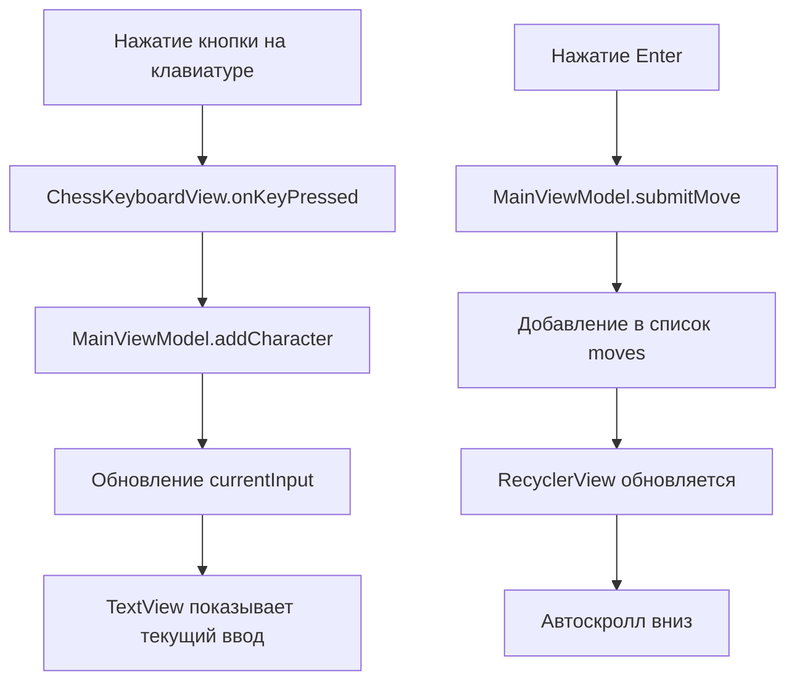
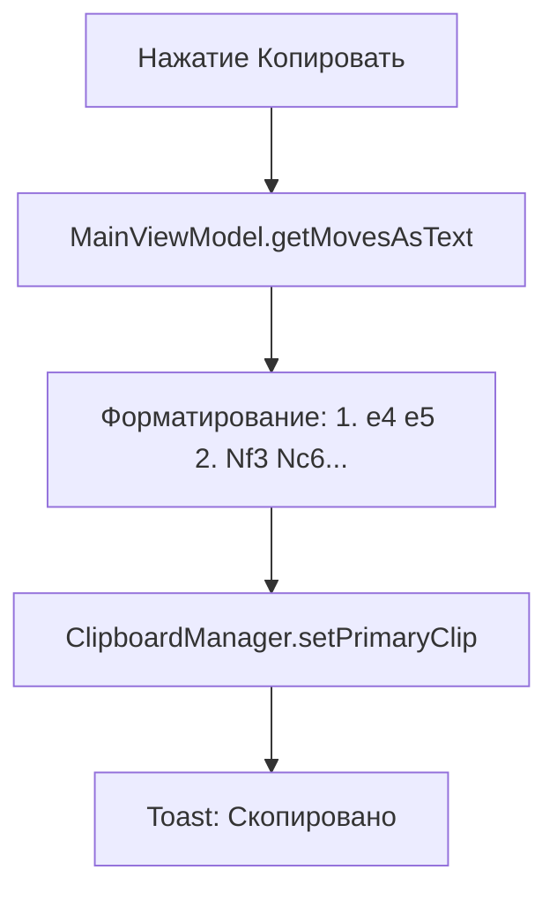

# Архитектура ChessSignature - Минималистичная версия

## 📋 Обзор проекта

**ChessSignature** - максимально простое Android-приложение для быстрого ввода шахматных ходов в алгебраической нотации.

### Ключевые возможности
- ✅ Быстрый ввод ходов через кастомную клавиатуру
- ✅ Отображение списка введенных ходов
- ✅ Копирование всей нотации в буфер обмена
- ✅ Очистка и начало новой партии

### Что НЕ входит
- ❌ Сохранение в базу данных
- ❌ История партий
- ❌ Визуализация доски
- ❌ Валидация ходов
- ❌ Экспорт в файлы

---

## 🏗️ Архитектура

Простейшая архитектура с одним экраном:

```
┌─────────────────────────────────┐
│         MainActivity            │
│  (ViewModel + View)             │
└─────────────────────────────────┘
```

---

## 📦 Структура данных

### Модель хода

```kotlin
data class Move(
    val moveNumber: Int,        // 1, 2, 3...
    val whiteMove: String,      // "e4", "Nf3", "O-O"
    val blackMove: String? = null  // "e5", "Nc6", null
)
```

### ViewModel состояние

```kotlin
class MainViewModel : ViewModel() {
    // Список всех ходов
    private val _moves = MutableStateFlow<List<Move>>(emptyList())
    val moves: StateFlow<List<Move>> = _moves.asStateFlow()
    
    // Текущий вводимый ход
    private val _currentInput = MutableStateFlow("")
    val currentInput: StateFlow<String> = _currentInput.asStateFlow()
    
    // Чей сейчас ход
    private var isWhiteTurn = true
    
    fun addCharacter(char: String) {
        _currentInput.value += char
    }
    
    fun deleteLastCharacter() {
        _currentInput.value = _currentInput.value.dropLast(1)
    }
    
    fun clearCurrentInput() {
        _currentInput.value = ""
    }
    
    fun submitMove() {
        val notation = _currentInput.value
        if (notation.isEmpty()) return
        
        val currentMoves = _moves.value.toMutableList()
        
        if (isWhiteTurn) {
            val moveNumber = currentMoves.size + 1
            currentMoves.add(Move(moveNumber, notation, null))
        } else {
            val lastMove = currentMoves.lastOrNull()
            if (lastMove != null) {
                currentMoves[currentMoves.lastIndex] = 
                    lastMove.copy(blackMove = notation)
            }
        }
        
        _moves.value = currentMoves
        _currentInput.value = ""
        isWhiteTurn = !isWhiteTurn
    }
    
    fun clearAllMoves() {
        _moves.value = emptyList()
        _currentInput.value = ""
        isWhiteTurn = true
    }
    
    fun getMovesAsText(): String {
        return _moves.value.joinToString(" ") { move ->
            if (move.blackMove != null) {
                "${move.moveNumber}. ${move.whiteMove} ${move.blackMove}"
            } else {
                "${move.moveNumber}. ${move.whiteMove}"
            }
        }
    }
}
```

---

## 🎨 UI Дизайн

### Единственный экран (MainActivity)

```
┌─────────────────────────────────────┐
│  ChessSignature                     │
│  [Очистить]  [Копировать]          │
├─────────────────────────────────────┤
│                                     │
│  Список ходов (RecyclerView)       │
│  ┌───────────────────────────────┐ │
│  │ 1. e4      e5                 │ │
│  │ 2. Nf3     Nc6                │ │
│  │ 3. Bb5     a6                 │ │
│  │ 4. Ba4     Nf6                │ │
│  │ 5. O-O     Be7                │ │
│  │ 6. Re1     b5                 │ │
│  │ 7. Bb3     d6                 │ │
│  │ 8. c3      O-O                │ │
│  │ 9. h3      _                  │ │
│  └───────────────────────────────┘ │
│                                     │
├─────────────────────────────────────┤
│  Текущий ввод: [Na6_]              │
├─────────────────────────────────────┤
│                                     │
│  Кастомная клавиатура               │
│  ┌───────────────────────────────┐ │
│  │ [K] [Q] [R] [B] [N]          │ │
│  │                               │ │
│  │ [a][b][c][d][e][f][g][h]     │ │
│  │ [1][2][3][4][5][6][7][8]     │ │
│  │                               │ │
│  │ [x] [+] [#] [=]              │ │
│  │ [O-O] [O-O-O]                │ │
│  │                               │ │
│  │ [←] [Очистить] [✓]           │ │
│  └───────────────────────────────┘ │
│                                     │
└─────────────────────────────────────┘
```

### Компоненты

1. **Toolbar**
   - Кнопка "Очистить" - очистить все ходы
   - Кнопка "Копировать" - скопировать нотацию в буфер

2. **RecyclerView** - список ходов
   - Каждая строка: "1. e4 e5"
   - Автоскролл к последнему ходу

3. **TextView** - текущий вводимый ход
   - Показывает то, что набирается

4. **ChessKeyboardView** - кастомная клавиатура

---

## 🎹 ChessKeyboardView

### Макет клавиатуры

```xml
<LinearLayout orientation="vertical">
    
    <!-- Ряд 1: Фигуры -->
    <LinearLayout orientation="horizontal">
        <Button text="K" />  <!-- Король -->
        <Button text="Q" />  <!-- Ферзь -->
        <Button text="R" />  <!-- Ладья -->
        <Button text="B" />  <!-- Слон -->
        <Button text="N" />  <!-- Конь -->
    </LinearLayout>
    
    <!-- Ряд 2: Вертикали -->
    <LinearLayout orientation="horizontal">
        <Button text="a" />
        <Button text="b" />
        <Button text="c" />
        <Button text="d" />
        <Button text="e" />
        <Button text="f" />
        <Button text="g" />
        <Button text="h" />
    </LinearLayout>
    
    <!-- Ряд 3: Горизонтали -->
    <LinearLayout orientation="horizontal">
        <Button text="1" />
        <Button text="2" />
        <Button text="3" />
        <Button text="4" />
        <Button text="5" />
        <Button text="6" />
        <Button text="7" />
        <Button text="8" />
    </LinearLayout>
    
    <!-- Ряд 4: Специальные символы -->
    <LinearLayout orientation="horizontal">
        <Button text="x" />      <!-- Взятие -->
        <Button text="+" />      <!-- Шах -->
        <Button text="#" />      <!-- Мат -->
        <Button text="=" />      <!-- Превращение -->
    </LinearLayout>
    
    <!-- Ряд 5: Рокировки -->
    <LinearLayout orientation="horizontal">
        <Button text="O-O" />    <!-- Короткая рокировка -->
        <Button text="O-O-O" />  <!-- Длинная рокировка -->
    </LinearLayout>
    
    <!-- Ряд 6: Управление -->
    <LinearLayout orientation="horizontal">
        <Button text="←" />          <!-- Backspace -->
        <Button text="Очистить" />   <!-- Clear -->
        <Button text="✓" />          <!-- Enter -->
    </LinearLayout>
    
</LinearLayout>
```

### Логика клавиатуры

```kotlin
class ChessKeyboardView @JvmOverloads constructor(
    context: Context,
    attrs: AttributeSet? = null
) : LinearLayout(context, attrs) {
    
    var onKeyPressed: ((String) -> Unit)? = null
    var onBackspace: (() -> Unit)? = null
    var onClear: (() -> Unit)? = null
    var onEnter: (() -> Unit)? = null
    
    init {
        orientation = VERTICAL
        inflate(context, R.layout.chess_keyboard, this)
        setupButtons()
    }
    
    private fun setupButtons() {
        // Фигуры
        findViewById<Button>(R.id.btnKing).setOnClickListener { 
            onKeyPressed?.invoke("K") 
        }
        findViewById<Button>(R.id.btnQueen).setOnClickListener { 
            onKeyPressed?.invoke("Q") 
        }
        // ... остальные фигуры
        
        // Поля
        ('a'..'h').forEach { file ->
            findViewById<Button>(getFileButtonId(file)).setOnClickListener {
                onKeyPressed?.invoke(file.toString())
            }
        }
        
        (1..8).forEach { rank ->
            findViewById<Button>(getRankButtonId(rank)).setOnClickListener {
                onKeyPressed?.invoke(rank.toString())
            }
        }
        
        // Специальные
        findViewById<Button>(R.id.btnCapture).setOnClickListener { 
            onKeyPressed?.invoke("x") 
        }
        findViewById<Button>(R.id.btnCheck).setOnClickListener { 
            onKeyPressed?.invoke("+") 
        }
        findViewById<Button>(R.id.btnCheckmate).setOnClickListener { 
            onKeyPressed?.invoke("#") 
        }
        findViewById<Button>(R.id.btnPromotion).setOnClickListener { 
            onKeyPressed?.invoke("=") 
        }
        
        // Рокировки
        findViewById<Button>(R.id.btnCastleShort).setOnClickListener { 
            onKeyPressed?.invoke("O-O") 
        }
        findViewById<Button>(R.id.btnCastleLong).setOnClickListener { 
            onKeyPressed?.invoke("O-O-O") 
        }
        
        // Управление
        findViewById<Button>(R.id.btnBackspace).setOnClickListener { 
            onBackspace?.invoke() 
        }
        findViewById<Button>(R.id.btnClear).setOnClickListener { 
            onClear?.invoke() 
        }
        findViewById<Button>(R.id.btnEnter).setOnClickListener { 
            onEnter?.invoke() 
        }
    }
}
```

---

## 🔄 Поток данных

### Ввод хода



### Копирование



---

## 📱 MainActivity

```kotlin
@AndroidEntryPoint
class MainActivity : AppCompatActivity() {
    
    private lateinit var binding: ActivityMainBinding
    private val viewModel: MainViewModel by viewModels()
    private lateinit var movesAdapter: MovesAdapter
    
    override fun onCreate(savedInstanceState: Bundle?) {
        super.onCreate(savedInstanceState)
        binding = ActivityMainBinding.inflate(layoutInflater)
        setContentView(binding.root)
        
        setupRecyclerView()
        setupKeyboard()
        setupToolbar()
        observeViewModel()
    }
    
    private fun setupRecyclerView() {
        movesAdapter = MovesAdapter()
        binding.recyclerMoves.apply {
            adapter = movesAdapter
            layoutManager = LinearLayoutManager(this@MainActivity)
        }
    }
    
    private fun setupKeyboard() {
        binding.chessKeyboard.apply {
            onKeyPressed = { char ->
                viewModel.addCharacter(char)
            }
            onBackspace = {
                viewModel.deleteLastCharacter()
            }
            onClear = {
                viewModel.clearCurrentInput()
            }
            onEnter = {
                viewModel.submitMove()
            }
        }
    }
    
    private fun setupToolbar() {
        binding.btnClear.setOnClickListener {
            showClearConfirmation()
        }
        
        binding.btnCopy.setOnClickListener {
            copyToClipboard()
        }
    }
    
    private fun observeViewModel() {
        lifecycleScope.launch {
            viewModel.moves.collect { moves ->
                movesAdapter.submitList(moves)
                // Автоскролл к последнему ходу
                if (moves.isNotEmpty()) {
                    binding.recyclerMoves.smoothScrollToPosition(moves.size - 1)
                }
            }
        }
        
        lifecycleScope.launch {
            viewModel.currentInput.collect { input ->
                binding.tvCurrentInput.text = input
            }
        }
    }
    
    private fun copyToClipboard() {
        val text = viewModel.getMovesAsText()
        if (text.isEmpty()) {
            Toast.makeText(this, "Нет ходов для копирования", Toast.LENGTH_SHORT).show()
            return
        }
        
        val clipboard = getSystemService(Context.CLIPBOARD_SERVICE) as ClipboardManager
        val clip = ClipData.newPlainText("Chess moves", text)
        clipboard.setPrimaryClip(clip)
        
        Toast.makeText(this, "Скопировано: $text", Toast.LENGTH_SHORT).show()
    }
    
    private fun showClearConfirmation() {
        AlertDialog.Builder(this)
            .setTitle("Очистить все ходы?")
            .setMessage("Это действие нельзя отменить")
            .setPositiveButton("Очистить") { _, _ ->
                viewModel.clearAllMoves()
            }
            .setNegativeButton("Отмена", null)
            .show()
    }
}
```

---

## 📋 MovesAdapter

```kotlin
class MovesAdapter : ListAdapter<Move, MovesAdapter.MoveViewHolder>(MoveDiffCallback()) {
    
    override fun onCreateViewHolder(parent: ViewGroup, viewType: Int): MoveViewHolder {
        val binding = ItemMoveBinding.inflate(
            LayoutInflater.from(parent.context),
            parent,
            false
        )
        return MoveViewHolder(binding)
    }
    
    override fun onBindViewHolder(holder: MoveViewHolder, position: Int) {
        holder.bind(getItem(position))
    }
    
    class MoveViewHolder(
        private val binding: ItemMoveBinding
    ) : RecyclerView.ViewHolder(binding.root) {
        
        fun bind(move: Move) {
            binding.tvMoveNumber.text = "${move.moveNumber}."
            binding.tvWhiteMove.text = move.whiteMove
            binding.tvBlackMove.text = move.blackMove ?: ""
        }
    }
    
    private class MoveDiffCallback : DiffUtil.ItemCallback<Move>() {
        override fun areItemsTheSame(oldItem: Move, newItem: Move): Boolean {
            return oldItem.moveNumber == newItem.moveNumber
        }
        
        override fun areContentsTheSame(oldItem: Move, newItem: Move): Boolean {
            return oldItem == newItem
        }
    }
}
```

---

## 🎨 Layout файлы

### activity_main.xml

```xml
<?xml version="1.0" encoding="utf-8"?>
<LinearLayout 
    xmlns:android="http://schemas.android.com/apk/res/android"
    android:layout_width="match_parent"
    android:layout_height="match_parent"
    android:orientation="vertical">
    
    <!-- Toolbar -->
    <LinearLayout
        android:layout_width="match_parent"
        android:layout_height="wrap_content"
        android:orientation="horizontal"
        android:padding="8dp"
        android:background="?attr/colorPrimary">
        
        <TextView
            android:layout_width="0dp"
            android:layout_height="wrap_content"
            android:layout_weight="1"
            android:text="ChessSignature"
            android:textColor="@android:color/white"
            android:textSize="20sp"
            android:textStyle="bold"/>
        
        <Button
            android:id="@+id/btnClear"
            android:layout_width="wrap_content"
            android:layout_height="wrap_content"
            android:text="Очистить"/>
        
        <Button
            android:id="@+id/btnCopy"
            android:layout_width="wrap_content"
            android:layout_height="wrap_content"
            android:text="Копировать"/>
    </LinearLayout>
    
    <!-- Список ходов -->
    <androidx.recyclerview.widget.RecyclerView
        android:id="@+id/recyclerMoves"
        android:layout_width="match_parent"
        android:layout_height="0dp"
        android:layout_weight="1"
        android:padding="8dp"/>
    
    <!-- Текущий ввод -->
    <TextView
        android:id="@+id/tvCurrentInput"
        android:layout_width="match_parent"
        android:layout_height="wrap_content"
        android:padding="16dp"
        android:textSize="18sp"
        android:textStyle="bold"
        android:background="#F5F5F5"
        android:hint="Введите ход..."/>
    
    <!-- Клавиатура -->
    <com.sin28x.chesssignature.ui.widget.ChessKeyboardView
        android:id="@+id/chessKeyboard"
        android:layout_width="match_parent"
        android:layout_height="wrap_content"
        android:background="#EEEEEE"/>
    
</LinearLayout>
```

### item_move.xml

```xml
<?xml version="1.0" encoding="utf-8"?>
<LinearLayout
    xmlns:android="http://schemas.android.com/apk/res/android"
    android:layout_width="match_parent"
    android:layout_height="wrap_content"
    android:orientation="horizontal"
    android:padding="8dp">
    
    <TextView
        android:id="@+id/tvMoveNumber"
        android:layout_width="wrap_content"
        android:layout_height="wrap_content"
        android:text="1."
        android:textSize="16sp"
        android:textStyle="bold"
        android:paddingEnd="8dp"/>
    
    <TextView
        android:id="@+id/tvWhiteMove"
        android:layout_width="0dp"
        android:layout_height="wrap_content"
        android:layout_weight="1"
        android:text="e4"
        android:textSize="16sp"
        android:paddingEnd="16dp"/>
    
    <TextView
        android:id="@+id/tvBlackMove"
        android:layout_width="0dp"
        android:layout_height="wrap_content"
        android:layout_weight="1"
        android:text="e5"
        android:textSize="16sp"/>
    
</LinearLayout>
```

---

## 📚 Зависимости

### gradle/libs.versions.toml

```toml
[versions]
agp = "8.2.0"
kotlin = "1.9.20"
coreKtx = "1.12.0"
appcompat = "1.6.1"
material = "1.11.0"
constraintlayout = "2.1.4"
lifecycle = "2.7.0"
activity = "1.8.2"
fragment = "1.6.2"

[libraries]
androidx-core-ktx = { group = "androidx.core", name = "core-ktx", version.ref = "coreKtx" }
androidx-appcompat = { group = "androidx.appcompat", name = "appcompat", version.ref = "appcompat" }
material = { group = "com.google.android.material", name = "material", version.ref = "material" }
androidx-constraintlayout = { group = "androidx.constraintlayout", name = "constraintlayout", version.ref = "constraintlayout" }
androidx-lifecycle-viewmodel-ktx = { group = "androidx.lifecycle", name = "lifecycle-viewmodel-ktx", version.ref = "lifecycle" }
androidx-lifecycle-runtime-ktx = { group = "androidx.lifecycle", name = "lifecycle-runtime-ktx", version.ref = "lifecycle" }
androidx-activity-ktx = { group = "androidx.activity", name = "activity-ktx", version.ref = "activity" }
androidx-fragment-ktx = { group = "androidx.fragment", name = "fragment-ktx", version.ref = "fragment" }

[plugins]
android-application = { id = "com.android.application", version.ref = "agp" }
kotlin-android = { id = "org.jetbrains.kotlin.android", version.ref = "kotlin" }
```

### app/build.gradle.kts

```kotlin
plugins {
    alias(libs.plugins.android.application)
    alias(libs.plugins.kotlin.android)
}

android {
    namespace = "com.sin28x.chesssignature"
    compileSdk = 34
    
    defaultConfig {
        applicationId = "com.sin28x.chesssignature"
        minSdk = 24
        targetSdk = 34
        versionCode = 1
        versionName = "1.0"
    }
    
    buildFeatures {
        viewBinding = true
    }
    
    compileOptions {
        sourceCompatibility = JavaVersion.VERSION_17
        targetCompatibility = JavaVersion.VERSION_17
    }
    
    kotlinOptions {
        jvmTarget = "17"
    }
}

dependencies {
    implementation(libs.androidx.core.ktx)
    implementation(libs.androidx.appcompat)
    implementation(libs.material)
    implementation(libs.androidx.constraintlayout)
    implementation(libs.androidx.lifecycle.viewmodel.ktx)
    implementation(libs.androidx.lifecycle.runtime.ktx)
    implementation(libs.androidx.activity.ktx)
    implementation(libs.androidx.fragment.ktx)
}
```

---

## 📂 Структура проекта

```
app/src/main/java/com/sin28x/chesssignature/
├── ui/
│   ├── MainActivity.kt
│   ├── MainViewModel.kt
│   ├── MovesAdapter.kt
│   └── widget/
│       └── ChessKeyboardView.kt
└── model/
    └── Move.kt

app/src/main/res/
├── layout/
│   ├── activity_main.xml
│   ├── item_move.xml
│   └── chess_keyboard.xml
├── values/
│   ├── strings.xml
│   ├── colors.xml
│   └── themes.xml
└── drawable/
    └── (иконки кнопок)
```

---

## 🚀 План разработки

### День 1-2: Основа
- [x] Настройка проекта
- [ ] Создание модели Move
- [ ] Создание MainViewModel
- [ ] Базовый layout activity_main.xml

### День 3-4: Клавиатура
- [ ] Создание ChessKeyboardView
- [ ] Layout chess_keyboard.xml
- [ ] Подключение к ViewModel

### День 5: Список ходов
- [ ] MovesAdapter
- [ ] item_move.xml
- [ ] Интеграция с RecyclerView

### День 6: Функционал
- [ ] Копирование в буфер
- [ ] Очистка ходов
- [ ] Диалог подтверждения

### День 7: Полировка
- [ ] Улучшение UI
- [ ] Тестирование
- [ ] Исправление багов

**Общее время: 1 неделя**

---

## 💡 Примеры использования

### Пример 1: Испанская партия
```
Пользователь вводит:
e4 → ✓ → e5 → ✓
Nf3 → ✓ → Nc6 → ✓
Bb5 → ✓

Результат в списке:
1. e4    e5
2. Nf3   Nc6
3. Bb5   _

Копирование: "1. e4 e5 2. Nf3 Nc6 3. Bb5"
```

### Пример 2: Рокировка
```
Пользователь вводит:
O-O → ✓ → O-O-O → ✓

Результат:
1. O-O   O-O-O

Копирование: "1. O-O O-O-O"
```

### Пример 3: Взятие с шахом
```
Пользователь вводит:
Bxf7 → + → ✓

Результат:
1. Bxf7+

Копирование: "1. Bxf7+"
```

---

## 🎨 Цветовая схема

```xml
<!-- res/values/colors.xml -->
<resources>
    <color name="primary">#2196F3</color>
    <color name="primary_dark">#1976D2</color>
    <color name="accent">#FF9800</color>
    
    <color name="keyboard_bg">#EEEEEE</color>
    <color name="keyboard_key">#FFFFFF</color>
    <color name="keyboard_key_pressed">#E0E0E0</color>
    
    <color name="input_bg">#F5F5F5</color>
    <color name="text_primary">#212121</color>
    <color name="text_secondary">#757575</color>
</resources>
```

---

## 📝 Итоговые характеристики

### Что получаем
- ✅ Максимально простое приложение
- ✅ Быстрый ввод ходов
- ✅ Копирование в буфер одной кнопкой
- ✅ Никаких лишних функций
- ✅ Быстрая разработка (1 неделя)
- ✅ Минимум зависимостей
- ✅ Легко поддерживать

### Размер приложения
- Примерно 2-3 МБ
- Минимальные требования: Android 7.0+

### Производительность
- Мгновенный отклик
- Нет задержек
- Минимальное потребление памяти

---

## 🔮 Возможные улучшения в будущем

Если понадобится расширить функционал:

- [ ] Сохранение последней партии при закрытии приложения (SharedPreferences)
- [ ] Темная тема
- [ ] Настройка размера кнопок клавиатуры
- [ ] Звуковые эффекты при нажатии
- [ ] Вибрация при нажатии
- [ ] Экспорт в файл .txt
- [ ] Отправка через Share Intent
- [ ] Поддержка ландшафтной ориентации

Но для MVP это не нужно!