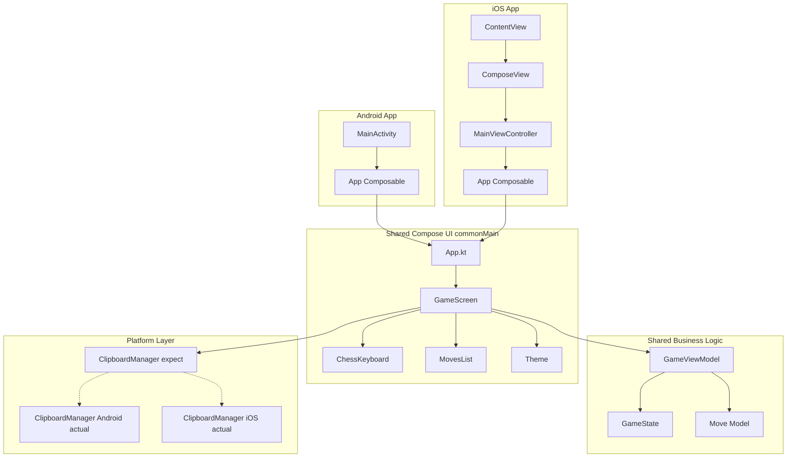

# Архитектура ChessSignature - Compose Multiplatform

## 📋 Обзор проекта

**ChessSignature** - полностью кроссплатформенное мобильное приложение (Android + iOS) для быстрого ввода шахматных ходов, построенное на **Compose Multiplatform** с **максимальным переиспользованием кода**.

### Ключевые возможности
- ✅ Быстрый ввод ходов через кастомную клавиатуру
- ✅ Отображение списка введенных ходов
- ✅ Копирование всей нотации в буфер обмена
- ✅ Очистка и начало новой партии
- ✅ **~95% общего кода между Android и iOS**
- ✅ **Единый UI на Compose для обеих платформ**

---

## 🏗️ Compose Multiplatform Архитектура

```
┌─────────────────────────────────────────────────────────┐
│                    Android App                          │
│              (тонкая обертка)                           │
└────────────────────┬────────────────────────────────────┘
                     │
┌────────────────────▼────────────────────────────────────┐
│              Shared Module (commonMain)                 │
│                                                          │
│  ┌────────────────────────────────────────────────┐    │
│  │         UI Layer (Compose Multiplatform)       │    │
│  │  • GameScreen.kt                               │    │
│  │  • ChessKeyboard.kt                            │    │
│  │  • MovesList.kt                                │    │
│  └────────────────────────────────────────────────┘    │
│                                                          │
│  ┌────────────────────────────────────────────────┐    │
│  │         Business Logic Layer                   │    │
│  │  • GameViewModel.kt                            │    │
│  │  • Models (Move, GameState)                    │    │
│  └────────────────────────────────────────────────┘    │
│                                                          │
│  ┌────────────────────────────────────────────────┐    │
│  │         Platform Layer (expect/actual)         │    │
│  │  • ClipboardManager                            │    │
│  └────────────────────────────────────────────────┘    │
└────────────────────┬────────────────────────────────────┘
                     │
┌────────────────────▼────────────────────────────────────┐
│                     iOS App                             │
│              (тонкая обертка)                           │
└─────────────────────────────────────────────────────────┘
```

---

## 📦 Структура проекта

```
ChessSignature/
├── composeApp/                      # Shared Compose код
│   └── src/
│       ├── commonMain/              # Общий код (UI + логика)
│       │   └── kotlin/
│       │       └── com/sin28x/chesssignature/
│       │           ├── App.kt       # Главный Composable
│       │           ├── ui/
│       │           │   ├── GameScreen.kt
│       │           │   ├── ChessKeyboard.kt
│       │           │   ├── MovesList.kt
│       │           │   └── theme/
│       │           │       ├── Color.kt
│       │           │       └── Theme.kt
│       │           ├── viewmodel/
│       │           │   └── GameViewModel.kt
│       │           ├── model/
│       │           │   ├── Move.kt
│       │           │   └── GameState.kt
│       │           └── platform/
│       │               └── ClipboardManager.kt (expect)
│       ├── androidMain/             # Android-специфичный код
│       │   └── kotlin/
│       │       └── com/sin28x/chesssignature/
│       │           └── platform/
│       │               └── ClipboardManager.android.kt
│       └── iosMain/                 # iOS-специфичный код
│           └── kotlin/
│               └── com/sin28x/chesssignature/
│                   └── platform/
│                       └── ClipboardManager.ios.kt
│
├── androidApp/                      # Android entry point
│   └── src/main/
│       └── kotlin/
│           └── com/sin28x/chesssignature/
│               └── MainActivity.kt
│
├── iosApp/                          # iOS entry point
│   └── iosApp/
│       └── ContentView.swift
│
├── gradle/
│   └── libs.versions.toml
├── build.gradle.kts
└── settings.gradle.kts
```

---

## 🎨 Shared UI Code (Compose Multiplatform)

### App.kt - Главная точка входа

```kotlin
package com.sin28x.chesssignature

import androidx.compose.material3.MaterialTheme
import androidx.compose.runtime.Composable
import com.sin28x.chesssignature.ui.GameScreen
import com.sin28x.chesssignature.ui.theme.ChessSignatureTheme

@Composable
fun App() {
    ChessSignatureTheme {
        GameScreen()
    }
}
```

### ui/GameScreen.kt

```kotlin
package com.sin28x.chesssignature.ui

import androidx.compose.foundation.layout.*
import androidx.compose.material.icons.Icons
import androidx.compose.material.icons.filled.Clear
import androidx.compose.material.icons.filled.ContentCopy
import androidx.compose.material3.*
import androidx.compose.runtime.*
import androidx.compose.ui.Modifier
import androidx.compose.ui.unit.dp
import com.sin28x.chesssignature.platform.ClipboardManager
import com.sin28x.chesssignature.viewmodel.GameViewModel

@OptIn(ExperimentalMaterial3Api::class)
@Composable
fun GameScreen() {
    val viewModel = remember { GameViewModel() }
    val state by viewModel.state.collectAsState()
    val clipboardManager = remember { ClipboardManager() }
    
    var showClearDialog by remember { mutableStateOf(false) }
    
    Scaffold(
        topBar = {
            TopAppBar(
                title = { Text("ChessSignature") },
                actions = {
                    IconButton(onClick = { showClearDialog = true }) {
                        Icon(Icons.Default.Clear, contentDescription = "Очистить")
                    }
                    IconButton(onClick = {
                        val text = viewModel.getMovesText()
                        if (text.isNotEmpty()) {
                            clipboardManager.copyToClipboard(text)
                        }
                    }) {
                        Icon(Icons.Default.ContentCopy, contentDescription = "Копировать")
                    }
                }
            )
        }
    ) { padding ->
        Column(
            modifier = Modifier
                .fillMaxSize()
                .padding(padding)
        ) {
            // Список ходов
            MovesList(
                moves = state.moves,
                modifier = Modifier
                    .weight(1f)
                    .fillMaxWidth()
            )
            
            // Текущий ввод
            Surface(
                modifier = Modifier.fillMaxWidth(),
                color = MaterialTheme.colorScheme.surfaceVariant
            ) {
                Text(
                    text = state.currentInput.ifEmpty { "Введите ход..." },
                    modifier = Modifier.padding(16.dp),
                    style = MaterialTheme.typography.titleLarge,
                    color = if (state.currentInput.isEmpty()) {
                        MaterialTheme.colorScheme.onSurfaceVariant.copy(alpha = 0.6f)
                    } else {
                        MaterialTheme.colorScheme.onSurfaceVariant
                    }
                )
            }
            
            // Клавиатура
            ChessKeyboard(
                onKeyPressed = { viewModel.addCharacter(it) },
                onBackspace = { viewModel.deleteLastCharacter() },
                onClear = { viewModel.clearCurrentInput() },
                onEnter = { viewModel.submitMove() },
                modifier = Modifier.fillMaxWidth()
            )
        }
    }
    
    // Диалог подтверждения очистки
    if (showClearDialog) {
        AlertDialog(
            onDismissRequest = { showClearDialog = false },
            title = { Text("Очистить все ходы?") },
            text = { Text("Это действие нельзя отменить") },
            confirmButton = {
                TextButton(onClick = {
                    viewModel.clearAllMoves()
                    showClearDialog = false
                }) {
                    Text("Очистить")
                }
            },
            dismissButton = {
                TextButton(onClick = { showClearDialog = false }) {
                    Text("Отмена")
                }
            }
        )
    }
}
```

### ui/ChessKeyboard.kt

```kotlin
package com.sin28x.chesssignature.ui

import androidx.compose.foundation.layout.*
import androidx.compose.material3.Button
import androidx.compose.material3.ButtonDefaults
import androidx.compose.material3.MaterialTheme
import androidx.compose.material3.Text
import androidx.compose.runtime.Composable
import androidx.compose.ui.Modifier
import androidx.compose.ui.unit.dp

@Composable
fun ChessKeyboard(
    onKeyPressed: (String) -> Unit,
    onBackspace: () -> Unit,
    onClear: () -> Unit,
    onEnter: () -> Unit,
    modifier: Modifier = Modifier
) {
    Column(
        modifier = modifier
            .padding(8.dp),
        verticalArrangement = Arrangement.spacedBy(4.dp)
    ) {
        // Ряд 1: Фигуры
        KeyRow(
            keys = listOf("K", "Q", "R", "B", "N"),
            onKeyPressed = onKeyPressed
        )
        
        // Ряд 2: Вертикали
        KeyRow(
            keys = ('a'..'h').map { it.toString() },
            onKeyPressed = onKeyPressed
        )
        
        // Ряд 3: Горизонтали
        KeyRow(
            keys = (1..8).map { it.toString() },
            onKeyPressed = onKeyPressed
        )
        
        // Ряд 4: Специальные символы
        KeyRow(
            keys = listOf("x", "+", "#", "="),
            onKeyPressed = onKeyPressed
        )
        
        // Ряд 5: Рокировки
        Row(
            modifier = Modifier.fillMaxWidth(),
            horizontalArrangement = Arrangement.spacedBy(4.dp)
        ) {
            KeyButton(
                text = "O-O",
                onClick = { onKeyPressed("O-O") },
                modifier = Modifier.weight(1f)
            )
            KeyButton(
                text = "O-O-O",
                onClick = { onKeyPressed("O-O-O") },
                modifier = Modifier.weight(1f)
            )
        }
        
        // Ряд 6: Управление
        Row(
            modifier = Modifier.fillMaxWidth(),
            horizontalArrangement = Arrangement.spacedBy(4.dp)
        ) {
            KeyButton(
                text = "←",
                onClick = onBackspace,
                modifier = Modifier.weight(1f)
            )
            KeyButton(
                text = "Очистить",
                onClick = onClear,
                modifier = Modifier.weight(1f)
            )
            KeyButton(
                text = "✓",
                onClick = onEnter,
                modifier = Modifier.weight(1f),
                isPrimary = true
            )
        }
    }
}

@Composable
private fun KeyRow(
    keys: List<String>,
    onKeyPressed: (String) -> Unit,
    modifier: Modifier = Modifier
) {
    Row(
        modifier = modifier.fillMaxWidth(),
        horizontalArrangement = Arrangement.spacedBy(4.dp)
    ) {
        keys.forEach { key ->
            KeyButton(
                text = key,
                onClick = { onKeyPressed(key) },
                modifier = Modifier.weight(1f)
            )
        }
    }
}

@Composable
private fun KeyButton(
    text: String,
    onClick: () -> Unit,
    modifier: Modifier = Modifier,
    isPrimary: Boolean = false
) {
    Button(
        onClick = onClick,
        modifier = modifier,
        colors = if (isPrimary) {
            ButtonDefaults.buttonColors()
        } else {
            ButtonDefaults.buttonColors(
                containerColor = MaterialTheme.colorScheme.surface,
                contentColor = MaterialTheme.colorScheme.onSurface
            )
        }
    ) {
        Text(text)
    }
}
```

### ui/MovesList.kt

```kotlin
package com.sin28x.chesssignature.ui

import androidx.compose.foundation.layout.*
import androidx.compose.foundation.lazy.LazyColumn
import androidx.compose.foundation.lazy.items
import androidx.compose.foundation.lazy.rememberLazyListState
import androidx.compose.material3.MaterialTheme
import androidx.compose.material3.Text
import androidx.compose.runtime.Composable
import androidx.compose.runtime.LaunchedEffect
import androidx.compose.ui.Modifier
import androidx.compose.ui.text.font.FontWeight
import androidx.compose.ui.unit.dp
import com.sin28x.chesssignature.model.Move

@Composable
fun MovesList(
    moves: List<Move>,
    modifier: Modifier = Modifier
) {
    val listState = rememberLazyListState()
    
    // Автоскролл к последнему ходу
    LaunchedEffect(moves.size) {
        if (moves.isNotEmpty()) {
            listState.animateScrollToItem(moves.size - 1)
        }
    }
    
    LazyColumn(
        modifier = modifier.padding(horizontal = 16.dp, vertical = 8.dp),
        state = listState,
        verticalArrangement = Arrangement.spacedBy(4.dp)
    ) {
        items(moves) { move ->
            MoveItem(move)
        }
    }
}

@Composable
private fun MoveItem(move: Move) {
    Row(
        modifier = Modifier.fillMaxWidth(),
        horizontalArrangement = Arrangement.spacedBy(8.dp)
    ) {
        Text(
            text = "${move.moveNumber}.",
            modifier = Modifier.width(40.dp),
            style = MaterialTheme.typography.bodyLarge,
            fontWeight = FontWeight.Bold
        )
        Text(
            text = move.whiteMove,
            modifier = Modifier.weight(1f),
            style = MaterialTheme.typography.bodyLarge
        )
        Text(
            text = move.blackMove ?: "",
            modifier = Modifier.weight(1f),
            style = MaterialTheme.typography.bodyLarge
        )
    }
}
```

### ui/theme/Theme.kt

```kotlin
package com.sin28x.chesssignature.ui.theme

import androidx.compose.foundation.isSystemInDarkTheme
import androidx.compose.material3.MaterialTheme
import androidx.compose.material3.darkColorScheme
import androidx.compose.material3.lightColorScheme
import androidx.compose.runtime.Composable

private val LightColorScheme = lightColorScheme(
    primary = md_theme_light_primary,
    onPrimary = md_theme_light_onPrimary,
    primaryContainer = md_theme_light_primaryContainer,
    onPrimaryContainer = md_theme_light_onPrimaryContainer,
    secondary = md_theme_light_secondary,
    onSecondary = md_theme_light_onSecondary,
    surface = md_theme_light_surface,
    onSurface = md_theme_light_onSurface,
    surfaceVariant = md_theme_light_surfaceVariant,
    onSurfaceVariant = md_theme_light_onSurfaceVariant
)

private val DarkColorScheme = darkColorScheme(
    primary = md_theme_dark_primary,
    onPrimary = md_theme_dark_onPrimary,
    primaryContainer = md_theme_dark_primaryContainer,
    onPrimaryContainer = md_theme_dark_onPrimaryContainer,
    secondary = md_theme_dark_secondary,
    onSecondary = md_theme_dark_onSecondary,
    surface = md_theme_dark_surface,
    onSurface = md_theme_dark_onSurface,
    surfaceVariant = md_theme_dark_surfaceVariant,
    onSurfaceVariant = md_theme_dark_onSurfaceVariant
)

@Composable
fun ChessSignatureTheme(
    darkTheme: Boolean = isSystemInDarkTheme(),
    content: @Composable () -> Unit
) {
    val colorScheme = if (darkTheme) DarkColorScheme else LightColorScheme
    
    MaterialTheme(
        colorScheme = colorScheme,
        content = content
    )
}
```

### ui/theme/Color.kt

```kotlin
package com.sin28x.chesssignature.ui.theme

import androidx.compose.ui.graphics.Color

// Light theme
val md_theme_light_primary = Color(0xFF2196F3)
val md_theme_light_onPrimary = Color(0xFFFFFFFF)
val md_theme_light_primaryContainer = Color(0xFFBBDEFB)
val md_theme_light_onPrimaryContainer = Color(0xFF0D47A1)
val md_theme_light_secondary = Color(0xFFFF9800)
val md_theme_light_onSecondary = Color(0xFFFFFFFF)
val md_theme_light_surface = Color(0xFFFFFFFF)
val md_theme_light_onSurface = Color(0xFF212121)
val md_theme_light_surfaceVariant = Color(0xFFF5F5F5)
val md_theme_light_onSurfaceVariant = Color(0xFF424242)

// Dark theme
val md_theme_dark_primary = Color(0xFF64B5F6)
val md_theme_dark_onPrimary = Color(0xFF0D47A1)
val md_theme_dark_primaryContainer = Color(0xFF1976D2)
val md_theme_dark_onPrimaryContainer = Color(0xFFE3F2FD)
val md_theme_dark_secondary = Color(0xFFFFB74D)
val md_theme_dark_onSecondary = Color(0xFFE65100)
val md_theme_dark_surface = Color(0xFF121212)
val md_theme_dark_onSurface = Color(0xFFE0E0E0)
val md_theme_dark_surfaceVariant = Color(0xFF1E1E1E)
val md_theme_dark_onSurfaceVariant = Color(0xFFBDBDBD)
```

---

## 🧠 Business Logic (Shared)

### viewmodel/GameViewModel.kt

```kotlin
package com.sin28x.chesssignature.viewmodel

import com.sin28x.chesssignature.model.GameState
import com.sin28x.chesssignature.model.Move
import kotlinx.coroutines.flow.MutableStateFlow
import kotlinx.coroutines.flow.StateFlow
import kotlinx.coroutines.flow.asStateFlow
import kotlinx.coroutines.flow.update

class GameViewModel {
    private val _state = MutableStateFlow(GameState())
    val state: StateFlow<GameState> = _state.asStateFlow()
    
    fun addCharacter(char: String) {
        _state.update { it.copy(currentInput = it.currentInput + char) }
    }
    
    fun deleteLastCharacter() {
        _state.update { it.copy(currentInput = it.currentInput.dropLast(1)) }
    }
    
    fun clearCurrentInput() {
        _state.update { it.copy(currentInput = "") }
    }
    
    fun submitMove() {
        val currentState = _state.value
        val notation = currentState.currentInput.trim()
        
        if (notation.isEmpty()) return
        
        val newMoves = currentState.moves.toMutableList()
        
        if (currentState.isWhiteTurn) {
            val moveNumber = newMoves.size + 1
            newMoves.add(Move(moveNumber, notation, null))
        } else {
            val lastMove = newMoves.lastOrNull()
            if (lastMove != null) {
                newMoves[newMoves.lastIndex] = lastMove.copy(blackMove = notation)
            }
        }
        
        _state.update {
            GameState(
                moves = newMoves,
                currentInput = "",
                isWhiteTurn = !currentState.isWhiteTurn
            )
        }
    }
    
    fun clearAllMoves() {
        _state.value = GameState()
    }
    
    fun getMovesText(): String {
        return _state.value.getMovesAsText()
    }
}
```

### model/Move.kt

```kotlin
package com.sin28x.chesssignature.model

data class Move(
    val moveNumber: Int,
    val whiteMove: String,
    val blackMove: String? = null
)
```

### model/GameState.kt

```kotlin
package com.sin28x.chesssignature.model

data class GameState(
    val moves: List<Move> = emptyList(),
    val currentInput: String = "",
    val isWhiteTurn: Boolean = true
) {
    fun getMovesAsText(): String {
        return moves.joinToString(" ") { move ->
            if (move.blackMove != null) {
                "${move.moveNumber}. ${move.whiteMove} ${move.blackMove}"
            } else {
                "${move.moveNumber}. ${move.whiteMove}"
            }
        }
    }
}
```

---

## 🔌 Platform-specific код

### platform/ClipboardManager.kt (expect)

```kotlin
package com.sin28x.chesssignature.platform

expect class ClipboardManager() {
    fun copyToClipboard(text: String)
}
```

### platform/ClipboardManager.android.kt (actual)

```kotlin
package com.sin28x.chesssignature.platform

import android.content.ClipData
import android.content.ClipboardManager as AndroidClipboardManager
import android.content.Context
import android.widget.Toast

actual class ClipboardManager {
    private var context: Context? = null
    
    fun init(context: Context) {
        this.context = context
    }
    
    actual fun copyToClipboard(text: String) {
        val ctx = context ?: return
        val clipboard = ctx.getSystemService(Context.CLIPBOARD_SERVICE) 
            as AndroidClipboardManager
        val clip = ClipData.newPlainText("Chess moves", text)
        clipboard.setPrimaryClip(clip)
        
        Toast.makeText(ctx, "Скопировано в буфер обмена", Toast.LENGTH_SHORT).show()
    }
}

// Глобальный экземпляр
lateinit var clipboardManager: ClipboardManager
```

### platform/ClipboardManager.ios.kt (actual)

```kotlin
package com.sin28x.chesssignature.platform

import platform.UIKit.UIPasteboard

actual class ClipboardManager {
    actual fun copyToClipboard(text: String) {
        UIPasteboard.generalPasteboard.string = text
    }
}
```

---

## 📱 Platform Entry Points

### Android: MainActivity.kt

```kotlin
package com.sin28x.chesssignature

import android.os.Bundle
import androidx.activity.ComponentActivity
import androidx.activity.compose.setContent
import com.sin28x.chesssignature.platform.clipboardManager

class MainActivity : ComponentActivity() {
    override fun onCreate(savedInstanceState: Bundle?) {
        super.onCreate(savedInstanceState)
        
        // Инициализация платформенных зависимостей
        clipboardManager.init(this)
        
        setContent {
            App()
        }
    }
}
```

### iOS: ContentView.swift

```swift
import SwiftUI
import ComposeApp

struct ContentView: View {
    var body: some View {
        ComposeView()
            .ignoresSafeArea(.all)
    }
}

struct ComposeView: UIViewControllerRepresentable {
    func makeUIViewController(context: Context) -> UIViewController {
        MainViewControllerKt.MainViewController()
    }
    
    func updateUIViewController(_ uiViewController: UIViewController, context: Context) {}
}
```

### iOS: MainViewController.kt

```kotlin
// composeApp/src/iosMain/kotlin/MainViewController.kt
import androidx.compose.ui.window.ComposeUIViewController
import com.sin28x.chesssignature.App

fun MainViewController() = ComposeUIViewController { App() }
```

---

## 📚 Зависимости

### gradle/libs.versions.toml

```toml
[versions]
kotlin = "1.9.21"
compose = "1.5.11"
agp = "8.2.0"
androidx-activityCompose = "1.8.2"
coroutines = "1.7.3"

[libraries]
androidx-activity-compose = { module = "androidx.activity:activity-compose", version.ref = "androidx-activityCompose" }
kotlinx-coroutines-core = { module = "org.jetbrains.kotlinx:kotlinx-coroutines-core", version.ref = "coroutines" }
kotlinx-coroutines-android = { module = "org.jetbrains.kotlinx:kotlinx-coroutines-android", version.ref = "coroutines" }

[plugins]
multiplatform = { id = "org.jetbrains.kotlin.multiplatform", version.ref = "kotlin" }
compose = { id = "org.jetbrains.compose", version.ref = "compose" }
android-application = { id = "com.android.application", version.ref = "agp" }
android-library = { id = "com.android.library", version.ref = "agp" }
```

### composeApp/build.gradle.kts

```kotlin
plugins {
    alias(libs.plugins.multiplatform)
    alias(libs.plugins.compose)
    alias(libs.plugins.android.library)
}

kotlin {
    androidTarget {
        compilations.all {
            kotlinOptions {
                jvmTarget = "17"
            }
        }
    }
    
    listOf(
        iosX64(),
        iosArm64(),
        iosSimulatorArm64()
    ).forEach { iosTarget ->
        iosTarget.binaries.framework {
            baseName = "ComposeApp"
            isStatic = true
        }
    }
    
    sourceSets {
        commonMain.dependencies {
            implementation(compose.runtime)
            implementation(compose.foundation)
            implementation(compose.material3)
            implementation(compose.components.resources)
            implementation(libs.kotlinx.coroutines.core)
        }
        
        androidMain.dependencies {
            implementation(libs.androidx.activity.compose)
            implementation(libs.kotlinx.coroutines.android)
        }
    }
}

android {
    namespace = "com.sin28x.chesssignature"
    compileSdk = 34
    
    defaultConfig {
        minSdk = 24
    }
    
    compileOptions {
        sourceCompatibility = JavaVersion.VERSION_17
        targetCompatibility = JavaVersion.VERSION_17
    }
}
```

### androidApp/build.gradle.kts

```kotlin
plugins {
    alias(libs.plugins.android.application)
    alias(libs.plugins.multiplatform)
    alias(libs.plugins.compose)
}

kotlin {
    androidTarget {
        compilations.all {
            kotlinOptions {
                jvmTarget = "17"
            }
        }
    }
    
    sourceSets {
        androidMain.dependencies {
            implementation(project(":composeApp"))
            implementation(libs.androidx.activity.compose)
        }
    }
}

android {
    namespace = "com.sin28x.chesssignature.android"
    compileSdk = 34
    
    defaultConfig {
        applicationId = "com.sin28x.chesssignature"
        minSdk = 24
        targetSdk = 34
        versionCode = 1
        versionName = "1.0"
    }
    
    compileOptions {
        sourceCompatibility = JavaVersion.VERSION_17
        targetCompatibility = JavaVersion.VERSION_17
    }
}
```

### settings.gradle.kts

```kotlin
rootProject.name = "ChessSignature"

include(":composeApp")
include(":androidApp")

pluginManagement {
    repositories {
        google()
        gradlePluginPortal()
        mavenCentral()
        maven("https://maven.pkg.jetbrains.space/public/p/compose/dev")
    }
}

dependencyResolutionManagement {
    repositories {
        google()
        mavenCentral()
        maven("https://maven.pkg.jetbrains.space/public/p/compose/dev")
    }
}
```

---

## 📊 Диаграмма архитектуры



---

## 🚀 План разработки

### Неделя 1: Настройка и основа
- [ ] Создание Compose Multiplatform проекта
- [ ] Настройка структуры модулей
- [ ] Создание моделей (Move, GameState)
- [ ] Реализация GameViewModel
- [ ] Базовая тема (Theme, Colors)

### Неделя 2: UI компоненты
- [ ] Создание GameScreen
- [ ] Реализация ChessKeyboard
- [ ] Реализация MovesList
- [ ] Интеграция с ViewModel
- [