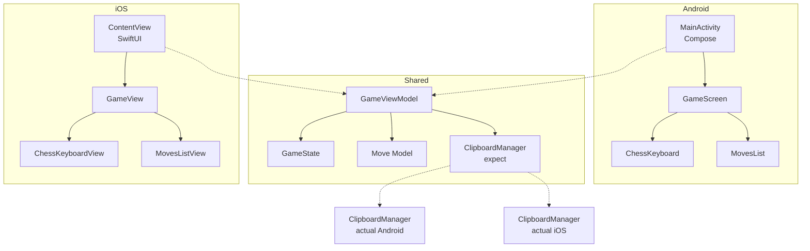

# Архитектура ChessSignature - KMM версия

## 📋 Обзор проекта

**ChessSignature** - кроссплатформенное мобильное приложение (Android + iOS) для быстрого ввода шахматных ходов в алгебраической нотации, построенное на Kotlin Multiplatform Mobile (KMM).

### Ключевые возможности
- ✅ Быстрый ввод ходов через кастомную клавиатуру
- ✅ Отображение списка введенных ходов
- ✅ Копирование всей нотации в буфер обмена
- ✅ Очистка и начало новой партии
- ✅ **Работает на Android и iOS с общей бизнес-логикой**

---

## 🏗️ KMM Архитектура

```
┌─────────────────────────────────────────────────────────┐
│                    Android App                          │
│              (Jetpack Compose UI)                       │
└────────────────────┬────────────────────────────────────┘
                     │
┌────────────────────▼────────────────────────────────────┐
│                  Shared Module                          │
│         (Kotlin Multiplatform - общая логика)           │
│  • ViewModel (общая)                                    │
│  • Models (Move, GameState)                             │
│  • Business Logic                                       │
│  • expect/actual для платформенных функций              │
└────────────────────┬────────────────────────────────────┘
                     │
┌────────────────────▼────────────────────────────────────┐
│                     iOS App                             │
│                 (SwiftUI UI)                            │
└─────────────────────────────────────────────────────────┘
```

---

## 📦 Структура проекта

```
ChessSignature/
├── shared/                          # KMM shared модуль
│   ├── src/
│   │   ├── commonMain/             # Общий код для всех платформ
│   │   │   └── kotlin/
│   │   │       └── com/sin28x/chesssignature/
│   │   │           ├── model/
│   │   │           │   ├── Move.kt
│   │   │           │   └── GameState.kt
│   │   │           ├── viewmodel/
│   │   │           │   └── GameViewModel.kt
│   │   │           └── platform/
│   │   │               └── ClipboardManager.kt (expect)
│   │   ├── androidMain/            # Android-специфичный код
│   │   │   └── kotlin/
│   │   │       └── com/sin28x/chesssignature/platform/
│   │   │           └── ClipboardManager.kt (actual)
│   │   └── iosMain/                # iOS-специфичный код
│   │       └── kotlin/
│   │           └── com/sin28x/chesssignature/platform/
│   │               └── ClipboardManager.kt (actual)
│   └── build.gradle.kts
│
├── androidApp/                      # Android приложение
│   ├── src/main/
│   │   └── kotlin/
│   │       └── com/sin28x/chesssignature/
│   │           ├── MainActivity.kt
│   │           ├── ui/
│   │           │   ├── GameScreen.kt
│   │           │   ├── ChessKeyboard.kt
│   │           │   └── MovesList.kt
│   │           └── theme/
│   │               └── Theme.kt
│   └── build.gradle.kts
│
├── iosApp/                          # iOS приложение
│   ├── iosApp/
│   │   ├── ContentView.swift
│   │   ├── GameView.swift
│   │   ├── ChessKeyboardView.swift
│   │   └── MovesListView.swift
│   └── iosApp.xcodeproj
│
├── build.gradle.kts                 # Root build file
└── settings.gradle.kts
```

---

## 🔄 Shared Module (commonMain)

### 1. Модели данных

**Move.kt**
```kotlin
package com.sin28x.chesssignature.model

data class Move(
    val moveNumber: Int,
    val whiteMove: String,
    val blackMove: String? = null
) {
    fun toDisplayString(): String {
        return if (blackMove != null) {
            "$moveNumber. $whiteMove $blackMove"
        } else {
            "$moveNumber. $whiteMove"
        }
    }
}
```

**GameState.kt**
```kotlin
package com.sin28x.chesssignature.model

data class GameState(
    val moves: List<Move> = emptyList(),
    val currentInput: String = "",
    val isWhiteTurn: Boolean = true
) {
    fun getMovesAsText(): String {
        return moves.joinToString(" ") { it.toDisplayString() }
    }
}
```

### 2. ViewModel (общая для обеих платформ)

**GameViewModel.kt**
```kotlin
package com.sin28x.chesssignature.viewmodel

import com.sin28x.chesssignature.model.GameState
import com.sin28x.chesssignature.model.Move
import kotlinx.coroutines.flow.MutableStateFlow
import kotlinx.coroutines.flow.StateFlow
import kotlinx.coroutines.flow.asStateFlow
import kotlinx.coroutines.flow.update

class GameViewModel {
    private val _state = MutableStateFlow(GameState())
    val state: StateFlow<GameState> = _state.asStateFlow()
    
    fun addCharacter(char: String) {
        _state.update { currentState ->
            currentState.copy(
                currentInput = currentState.currentInput + char
            )
        }
    }
    
    fun deleteLastCharacter() {
        _state.update { currentState ->
            currentState.copy(
                currentInput = currentState.currentInput.dropLast(1)
            )
        }
    }
    
    fun clearCurrentInput() {
        _state.update { currentState ->
            currentState.copy(currentInput = "")
        }
    }
    
    fun submitMove() {
        val currentState = _state.value
        val notation = currentState.currentInput
        
        if (notation.isEmpty()) return
        
        val newMoves = currentState.moves.toMutableList()
        
        if (currentState.isWhiteTurn) {
            val moveNumber = newMoves.size + 1
            newMoves.add(Move(moveNumber, notation, null))
        } else {
            val lastMove = newMoves.lastOrNull()
            if (lastMove != null) {
                newMoves[newMoves.lastIndex] = lastMove.copy(blackMove = notation)
            }
        }
        
        _state.update {
            GameState(
                moves = newMoves,
                currentInput = "",
                isWhiteTurn = !currentState.isWhiteTurn
            )
        }
    }
    
    fun clearAllMoves() {
        _state.value = GameState()
    }
    
    fun getMovesText(): String {
        return _state.value.getMovesAsText()
    }
}
```

### 3. Platform-specific код (expect/actual)

**ClipboardManager.kt (commonMain - expect)**
```kotlin
package com.sin28x.chesssignature.platform

expect class ClipboardManager {
    fun copyToClipboard(text: String)
}
```

**ClipboardManager.kt (androidMain - actual)**
```kotlin
package com.sin28x.chesssignature.platform

import android.content.ClipData
import android.content.ClipboardManager as AndroidClipboardManager
import android.content.Context
import android.widget.Toast

actual class ClipboardManager(private val context: Context) {
    actual fun copyToClipboard(text: String) {
        val clipboard = context.getSystemService(Context.CLIPBOARD_SERVICE) 
            as AndroidClipboardManager
        val clip = ClipData.newPlainText("Chess moves", text)
        clipboard.setPrimaryClip(clip)
        
        Toast.makeText(context, "Скопировано: $text", Toast.LENGTH_SHORT).show()
    }
}
```

**ClipboardManager.kt (iosMain - actual)**
```kotlin
package com.sin28x.chesssignature.platform

import platform.UIKit.UIPasteboard

actual class ClipboardManager {
    actual fun copyToClipboard(text: String) {
        UIPasteboard.generalPasteboard.string = text
        // iOS не показывает Toast, но можно добавить через callback
    }
}
```

---

## 📱 Android App (Jetpack Compose)

### MainActivity.kt

```kotlin
package com.sin28x.chesssignature

import android.os.Bundle
import androidx.activity.ComponentActivity
import androidx.activity.compose.setContent
import androidx.compose.foundation.layout.*
import androidx.compose.material3.*
import androidx.compose.runtime.*
import androidx.compose.ui.Modifier
import com.sin28x.chesssignature.ui.GameScreen
import com.sin28x.chesssignature.ui.theme.ChessSignatureTheme

class MainActivity : ComponentActivity() {
    override fun onCreate(savedInstanceState: Bundle?) {
        super.onCreate(savedInstanceState)
        setContent {
            ChessSignatureTheme {
                Surface(
                    modifier = Modifier.fillMaxSize(),
                    color = MaterialTheme.colorScheme.background
                ) {
                    GameScreen()
                }
            }
        }
    }
}
```

### GameScreen.kt

```kotlin
package com.sin28x.chesssignature.ui

import androidx.compose.foundation.layout.*
import androidx.compose.material.icons.Icons
import androidx.compose.material.icons.filled.Clear
import androidx.compose.material.icons.filled.ContentCopy
import androidx.compose.material3.*
import androidx.compose.runtime.*
import androidx.compose.ui.Modifier
import androidx.compose.ui.platform.LocalContext
import androidx.compose.ui.unit.dp
import com.sin28x.chesssignature.platform.ClipboardManager
import com.sin28x.chesssignature.viewmodel.GameViewModel

@OptIn(ExperimentalMaterial3Api::class)
@Composable
fun GameScreen(
    viewModel: GameViewModel = remember { GameViewModel() }
) {
    val state by viewModel.state.collectAsState()
    val context = LocalContext.current
    val clipboardManager = remember { ClipboardManager(context) }
    
    Scaffold(
        topBar = {
            TopAppBar(
                title = { Text("ChessSignature") },
                actions = {
                    IconButton(onClick = { viewModel.clearAllMoves() }) {
                        Icon(Icons.Default.Clear, "Очистить")
                    }
                    IconButton(onClick = {
                        clipboardManager.copyToClipboard(viewModel.getMovesText())
                    }) {
                        Icon(Icons.Default.ContentCopy, "Копировать")
                    }
                }
            )
        }
    ) { padding ->
        Column(
            modifier = Modifier
                .fillMaxSize()
                .padding(padding)
        ) {
            // Список ходов
            MovesList(
                moves = state.moves,
                modifier = Modifier
                    .weight(1f)
                    .fillMaxWidth()
            )
            
            // Текущий ввод
            Text(
                text = state.currentInput.ifEmpty { "Введите ход..." },
                modifier = Modifier
                    .fillMaxWidth()
                    .padding(16.dp),
                style = MaterialTheme.typography.titleLarge
            )
            
            // Клавиатура
            ChessKeyboard(
                onKeyPressed = { viewModel.addCharacter(it) },
                onBackspace = { viewModel.deleteLastCharacter() },
                onClear = { viewModel.clearCurrentInput() },
                onEnter = { viewModel.submitMove() },
                modifier = Modifier.fillMaxWidth()
            )
        }
    }
}
```

### ChessKeyboard.kt

```kotlin
package com.sin28x.chesssignature.ui

import androidx.compose.foundation.layout.*
import androidx.compose.material3.Button
import androidx.compose.material3.Text
import androidx.compose.runtime.Composable
import androidx.compose.ui.Modifier
import androidx.compose.ui.unit.dp

@Composable
fun ChessKeyboard(
    onKeyPressed: (String) -> Unit,
    onBackspace: () -> Unit,
    onClear: () -> Unit,
    onEnter: () -> Unit,
    modifier: Modifier = Modifier
) {
    Column(
        modifier = modifier.padding(8.dp),
        verticalArrangement = Arrangement.spacedBy(4.dp)
    ) {
        // Ряд 1: Фигуры
        Row(
            modifier = Modifier.fillMaxWidth(),
            horizontalArrangement = Arrangement.spacedBy(4.dp)
        ) {
            listOf("K", "Q", "R", "B", "N").forEach { piece ->
                Button(
                    onClick = { onKeyPressed(piece) },
                    modifier = Modifier.weight(1f)
                ) {
                    Text(piece)
                }
            }
        }
        
        // Ряд 2: Вертикали
        Row(
            modifier = Modifier.fillMaxWidth(),
            horizontalArrangement = Arrangement.spacedBy(4.dp)
        ) {
            ('a'..'h').forEach { file ->
                Button(
                    onClick = { onKeyPressed(file.toString()) },
                    modifier = Modifier.weight(1f)
                ) {
                    Text(file.toString())
                }
            }
        }
        
        // Ряд 3: Горизонтали
        Row(
            modifier = Modifier.fillMaxWidth(),
            horizontalArrangement = Arrangement.spacedBy(4.dp)
        ) {
            (1..8).forEach { rank ->
                Button(
                    onClick = { onKeyPressed(rank.toString()) },
                    modifier = Modifier.weight(1f)
                ) {
                    Text(rank.toString())
                }
            }
        }
        
        // Ряд 4: Специальные символы
        Row(
            modifier = Modifier.fillMaxWidth(),
            horizontalArrangement = Arrangement.spacedBy(4.dp)
        ) {
            listOf("x", "+", "#", "=").forEach { symbol ->
                Button(
                    onClick = { onKeyPressed(symbol) },
                    modifier = Modifier.weight(1f)
                ) {
                    Text(symbol)
                }
            }
        }
        
        // Ряд 5: Рокировки
        Row(
            modifier = Modifier.fillMaxWidth(),
            horizontalArrangement = Arrangement.spacedBy(4.dp)
        ) {
            Button(
                onClick = { onKeyPressed("O-O") },
                modifier = Modifier.weight(1f)
            ) {
                Text("O-O")
            }
            Button(
                onClick = { onKeyPressed("O-O-O") },
                modifier = Modifier.weight(1f)
            ) {
                Text("O-O-O")
            }
        }
        
        // Ряд 6: Управление
        Row(
            modifier = Modifier.fillMaxWidth(),
            horizontalArrangement = Arrangement.spacedBy(4.dp)
        ) {
            Button(
                onClick = onBackspace,
                modifier = Modifier.weight(1f)
            ) {
                Text("←")
            }
            Button(
                onClick = onClear,
                modifier = Modifier.weight(1f)
            ) {
                Text("Очистить")
            }
            Button(
                onClick = onEnter,
                modifier = Modifier.weight(1f)
            ) {
                Text("✓")
            }
        }
    }
}
```

### MovesList.kt

```kotlin
package com.sin28x.chesssignature.ui

import androidx.compose.foundation.layout.*
import androidx.compose.foundation.lazy.LazyColumn
import androidx.compose.foundation.lazy.items
import androidx.compose.material3.Text
import androidx.compose.runtime.Composable
import androidx.compose.ui.Modifier
import androidx.compose.ui.unit.dp
import com.sin28x.chesssignature.model.Move

@Composable
fun MovesList(
    moves: List<Move>,
    modifier: Modifier = Modifier
) {
    LazyColumn(
        modifier = modifier.padding(8.dp),
        verticalArrangement = Arrangement.spacedBy(4.dp)
    ) {
        items(moves) { move ->
            Row(
                modifier = Modifier.fillMaxWidth(),
                horizontalArrangement = Arrangement.spacedBy(8.dp)
            ) {
                Text(
                    text = "${move.moveNumber}.",
                    modifier = Modifier.width(40.dp)
                )
                Text(
                    text = move.whiteMove,
                    modifier = Modifier.weight(1f)
                )
                Text(
                    text = move.blackMove ?: "",
                    modifier = Modifier.weight(1f)
                )
            }
        }
    }
}
```

---

## 🍎 iOS App (SwiftUI)

### ContentView.swift

```swift
import SwiftUI
import shared

struct ContentView: View {
    @StateObject private var viewModel = GameViewModelWrapper()
    
    var body: some View {
        GameView(viewModel: viewModel)
    }
}

class GameViewModelWrapper: ObservableObject {
    let viewModel = GameViewModel()
    @Published var state: GameState = GameState(
        moves: [],
        currentInput: "",
        isWhiteTurn: true
    )
    
    init() {
        // Подписка на изменения state
        viewModel.state.collect { [weak self] newState in
            self?.state = newState
        }
    }
}
```

### GameView.swift

```swift
import SwiftUI
import shared

struct GameView: View {
    @ObservedObject var viewModel: GameViewModelWrapper
    
    var body: some View {
        NavigationView {
            VStack(spacing: 0) {
                // Список ходов
                MovesListView(moves: viewModel.state.moves)
                    .frame(maxHeight: .infinity)
                
                // Текущий ввод
                Text(viewModel.state.currentInput.isEmpty ? 
                     "Введите ход..." : viewModel.state.currentInput)
                    .font(.title2)
                    .padding()
                    .frame(maxWidth: .infinity, alignment: .leading)
                    .background(Color.gray.opacity(0.1))
                
                // Клавиатура
                ChessKeyboardView(
                    onKeyPressed: { char in
                        viewModel.viewModel.addCharacter(char: char)
                    },
                    onBackspace: {
                        viewModel.viewModel.deleteLastCharacter()
                    },
                    onClear: {
                        viewModel.viewModel.clearCurrentInput()
                    },
                    onEnter: {
                        viewModel.viewModel.submitMove()
                    }
                )
            }
            .navigationTitle("ChessSignature")
            .toolbar {
                ToolbarItem(placement: .navigationBarTrailing) {
                    Button(action: {
                        viewModel.viewModel.clearAllMoves()
                    }) {
                        Image(systemName: "trash")
                    }
                }
                ToolbarItem(placement: .navigationBarTrailing) {
                    Button(action: {
                        let text = viewModel.viewModel.getMovesText()
                        UIPasteboard.general.string = text
                    }) {
                        Image(systemName: "doc.on.doc")
                    }
                }
            }
        }
    }
}
```

### ChessKeyboardView.swift

```swift
import SwiftUI

struct ChessKeyboardView: View {
    let onKeyPressed: (String) -> Void
    let onBackspace: () -> Void
    let onClear: () -> Void
    let onEnter: () -> Void
    
    var body: some View {
        VStack(spacing: 4) {
            // Ряд 1: Фигуры
            HStack(spacing: 4) {
                ForEach(["K", "Q", "R", "B", "N"], id: \.self) { piece in
                    KeyButton(text: piece, action: { onKeyPressed(piece) })
                }
            }
            
            // Ряд 2: Вертикали
            HStack(spacing: 4) {
                ForEach(["a", "b", "c", "d", "e", "f", "g", "h"], id: \.self) { file in
                    KeyButton(text: file, action: { onKeyPressed(file) })
                }
            }
            
            // Ряд 3: Горизонтали
            HStack(spacing: 4) {
                ForEach(1...8, id: \.self) { rank in
                    KeyButton(text: "\(rank)", action: { onKeyPressed("\(rank)") })
                }
            }
            
            // Ряд 4: Специальные
            HStack(spacing: 4) {
                ForEach(["x", "+", "#", "="], id: \.self) { symbol in
                    KeyButton(text: symbol, action: { onKeyPressed(symbol) })
                }
            }
            
            // Ряд 5: Рокировки
            HStack(spacing: 4) {
                KeyButton(text: "O-O", action: { onKeyPressed("O-O") })
                KeyButton(text: "O-O-O", action: { onKeyPressed("O-O-O") })
            }
            
            // Ряд 6: Управление
            HStack(spacing: 4) {
                KeyButton(text: "←", action: onBackspace)
                KeyButton(text: "Очистить", action: onClear)
                KeyButton(text: "✓", action: onEnter)
            }
        }
        .padding(8)
        .background(Color.gray.opacity(0.1))
    }
}

struct KeyButton: View {
    let text: String
    let action: () -> Void
    
    var body: some View {
        Button(action: action) {
            Text(text)
                .frame(maxWidth: .infinity)
                .padding(.vertical, 12)
                .background(Color.white)
                .cornerRadius(8)
        }
    }
}
```

### MovesListView.swift

```swift
import SwiftUI
import shared

struct MovesListView: View {
    let moves: [Move]
    
    var body: some View {
        ScrollView {
            LazyVStack(alignment: .leading, spacing: 4) {
                ForEach(moves, id: \.moveNumber) { move in
                    HStack(spacing: 8) {
                        Text("\(move.moveNumber).")
                            .frame(width: 40, alignment: .leading)
                        Text(move.whiteMove)
                            .frame(maxWidth: .infinity, alignment: .leading)
                        Text(move.blackMove ?? "")
                            .frame(maxWidth: .infinity, alignment: .leading)
                    }
                    .padding(.horizontal)
                }
            }
        }
    }
}
```

---

## 📚 Зависимости

### settings.gradle.kts

```kotlin
pluginManagement {
    repositories {
        google()
        gradlePluginPortal()
        mavenCentral()
    }
}

dependencyResolutionManagement {
    repositories {
        google()
        mavenCentral()
    }
}

rootProject.name = "ChessSignature"
include(":androidApp")
include(":shared")
```

### shared/build.gradle.kts

```kotlin
plugins {
    kotlin("multiplatform")
    id("com.android.library")
}

kotlin {
    androidTarget {
        compilations.all {
            kotlinOptions {
                jvmTarget = "17"
            }
        }
    }
    
    listOf(
        iosX64(),
        iosArm64(),
        iosSimulatorArm64()
    ).forEach {
        it.binaries.framework {
            baseName = "shared"
            isStatic = true
        }
    }

    sourceSets {
        val commonMain by getting {
            dependencies {
                implementation("org.jetbrains.kotlinx:kotlinx-coroutines-core:1.7.3")
            }
        }
        val commonTest by getting {
            dependencies {
                implementation(kotlin("test"))
            }
        }
        val androidMain by getting {
            dependencies {
                implementation("androidx.core:core-ktx:1.12.0")
            }
        }
        val iosX64Main by getting
        val iosArm64Main by getting
        val iosSimulatorArm64Main by getting
        val iosMain by creating {
            dependsOn(commonMain)
            iosX64Main.dependsOn(this)
            iosArm64Main.dependsOn(this)
            iosSimulatorArm64Main.dependsOn(this)
        }
    }
}

android {
    namespace = "com.sin28x.chesssignature"
    compileSdk = 34
    defaultConfig {
        minSdk = 24
    }
    compileOptions {
        sourceCompatibility = JavaVersion.VERSION_17
        targetCompatibility = JavaVersion.VERSION_17
    }
}
```

### androidApp/build.gradle.kts

```kotlin
plugins {
    id("com.android.application")
    kotlin("android")
}

android {
    namespace = "com.sin28x.chesssignature.android"
    compileSdk = 34
    
    defaultConfig {
        applicationId = "com.sin28x.chesssignature.android"
        minSdk = 24
        targetSdk = 34
        versionCode = 1
        versionName = "1.0"
    }
    
    buildFeatures {
        compose = true
    }
    
    composeOptions {
        kotlinCompilerExtensionVersion = "1.5.3"
    }
    
    compileOptions {
        sourceCompatibility = JavaVersion.VERSION_17
        targetCompatibility = JavaVersion.VERSION_17
    }
    
    kotlinOptions {
        jvmTarget = "17"
    }
}

dependencies {
    implementation(project(":shared"))
    implementation("androidx.compose.ui:ui:1.5.4")
    implementation("androidx.compose.ui:ui-tooling:1.5.4")
    implementation("androidx.compose.ui:ui-tooling-preview:1.5.4")
    implementation("androidx.compose.foundation:foundation:1.5.4")
    implementation("androidx.compose.material3:material3:1.1.2")
    implementation("androidx.activity:activity-compose:1.8.2")
}
```

### build.gradle.kts (root)

```kotlin
plugins {
    kotlin("multiplatform").version("1.9.20").apply(false)
    kotlin("android").version("1.9.20").apply(false)
    id("com.android.application").version("8.2.0").apply(false)
    id("com.android.library").version("8.2.0").apply(false)
}
```

---

## 🚀 План разработки KMM

### Неделя 1: Shared модуль
- [ ] Настройка KMM проекта
- [ ] Создание моделей (Move, GameState)
- [ ] Реализация GameViewModel
- [ ] Настройка expect/actual для ClipboardManager

### Неделя 2: Android UI
- [ ] Настройка Jetpack Compose
- [ ] Создание GameScreen
- [ ] Реализация ChessKeyboard
- [ ] Реализация MovesList
- [ ] Интеграция с shared ViewModel

### Неделя 3: iOS UI
- [ ] Настройка Xcode проекта
- [ ] Создание SwiftUI views
- [ ] Интеграция с shared framework
- [ ] Тестирование на симуляторе

### Неделя 4: Полировка
- [ ] Тестирование на обеих платформах
- [ ] Исправление багов
- [ ] UI/UX улучшения
- [ ] Подготовка к релизу

**Общее время: 4 недели**

---

## 💡 Преимущества KMM подхода

### ✅ Что общее (shared)
- Бизнес-логика (GameViewModel)
- Модели данных (Move, GameState)
- Логика работы с ходами
- Форматирование нотации

### 📱 Что платформенное
- UI (Compose для Android, SwiftUI для iOS)
- Копирование в буфер (expect/actual)
- Навигация
- Платформенные стили

### 🎯 Результат
- **~70% кода общего** между платформами
- Нативный UI на каждой платформе
- Единая бизнес-логика
- Легко поддерживать

---

## 📊 Диаграмма архитектуры



---

## 🔧 Команды для запуска

### Android
```bash
./gradlew :androidApp:installDebug
```

### iOS
```bash
cd iosApp
xcodebuild -scheme iosApp -configuration Debug
```

---

## 📝 Итоговые характеристики

### Размер приложений
- **Android**: ~5-7 МБ
- **iOS**: ~8-10 МБ

### Поддерживаемые версии
- **Android**: 7.0+ (API 24+)
- **iOS**: 14.0+

### Производительность
- Мгновенный отклик на обеих платформах
- Нативный UI
- Минимальное потребление памяти

---

## 